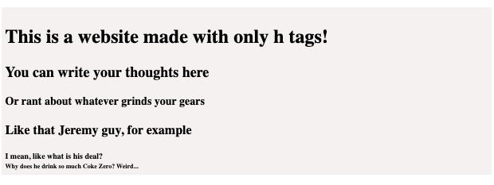
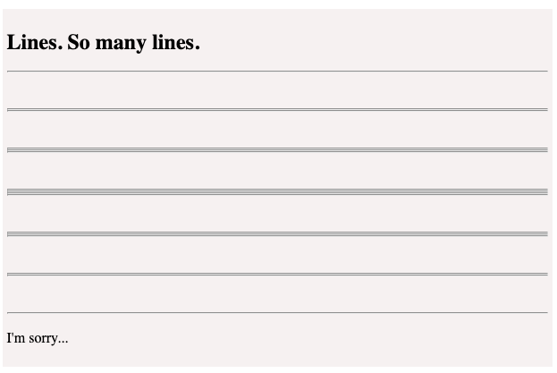
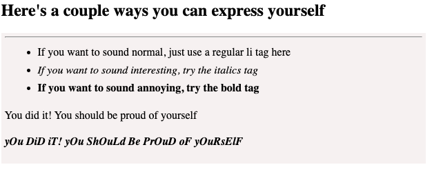

# HTML-CSS 101 Homework

1. Headings 
 

2. Nesting Tags
 

3. Lists
 

4. Lines 
 

5. Styling Text
 

6. Images
 

7. Links
 

8. Linking Images
 

9. Complete [CSS Diner](https://flukeout.github.io/)

10. Create a basic website!

- Start with the home page at index.html 
- Create pages for individual topics. 
    - These can your interest, passions, family, cats, or anything else. 
- Link the different pages to one another (via nav or links in the content). 
- Include images Make use of tags you learned Make use of CSS styling
- Host your site on github pages 
- Make 5-10 different pages. Put good content in them

A few ideas:

- Document a few of the python projects you created with screenshots, pre-formatted code, and a brief description. 
- Create a hypertext version of notes you've taken during class, including links to external resources. 
- Create a (hopefully non-creepy) fan page for something you love.

Examples: https://creativemarket.com/blog/90s-web-designs

Though we will explore more HTML and CSS in upcoming lessons, don't be afraid to use tags and styles we haven't gone over!

[HTML Cheatsheet](https://hostingreviewbox.com/wp-content/uploads/2016/02/html5-cheat-sheet-1.png)
[CSS Cheatsheet](https://htmlcheatsheet.com/css/)
