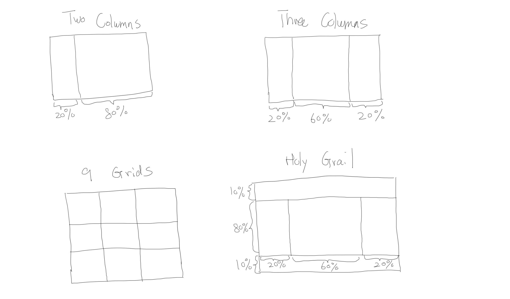
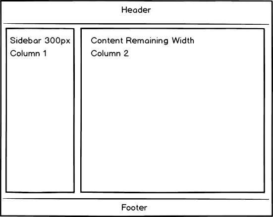

# Box Model, Display, Centering, Positioning, Floats Homework

1. Layout practice! Header, footer, sidebar, and main

A very common layout for a website is to have the following elements:
- A header
- A footer
- Sidebar (on the left or right) that holds navigation links
- A main content area

[Here is an example diagram of the layout](https://www.vanseodesign.com/blog/wp-content/uploads/2011/05/2-col-demo-sidebar-left.png)

Using your newly found CSS powers, implement this layout using a mix of techniques:

box model, floating/clearing, and positioning.

2. Positioning

Make the 2 column and Holy Grail layouts using absolute positioning.

- You will use a 
 element for each box you make
- you will use the left, top, width, and height CSS properties to positionthem into place, using percentage units so that the layout will adjust to the size of the browser window. 

<i>To allow you to see where the boxes are, you should give each box a different background color.</i>

3. Floats 

Make the layout below using CSS Floats. 

<i>Use different color backgrounds so you can see the width and height of each column. Content for each column should have varying heights.</i>

4. Challenge 1

Make the layout below using CSS Floats. Make it appear that the columns have the same height even if the content is not the same height.

4. Challenge 2

Complete the 3 column and 9 Grids layouts.

[Here is an example diagram of the layout](https://www.vanseodesign.com/blog/wp-content/uploads/2011/05/2-col-demo-sidebar-left.png)